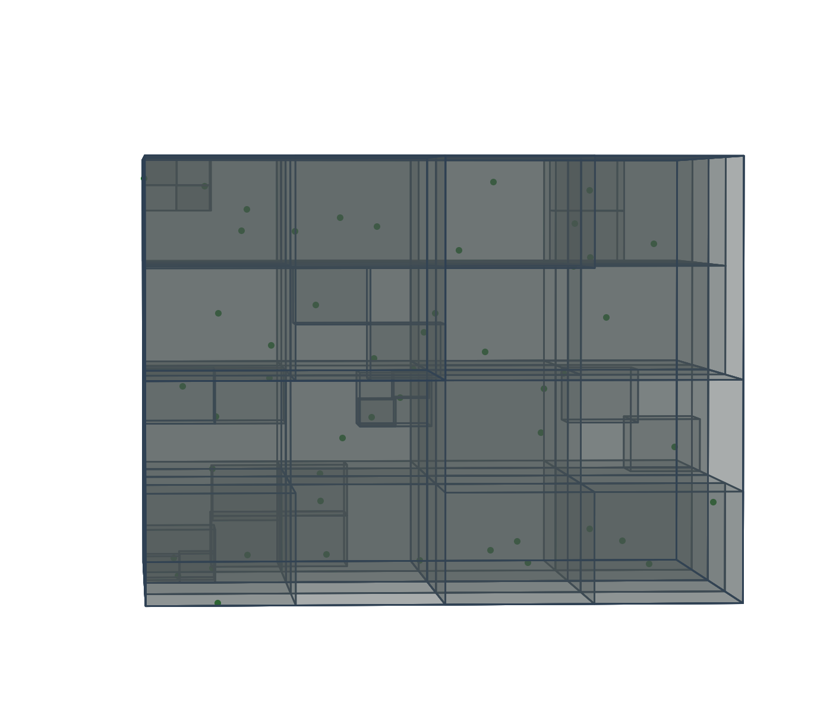
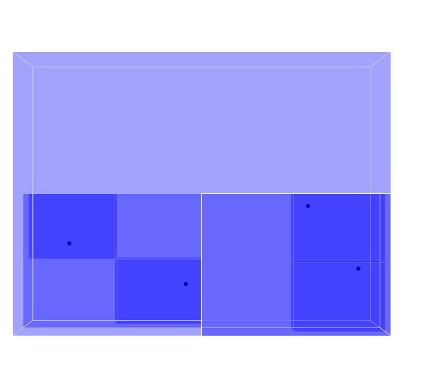
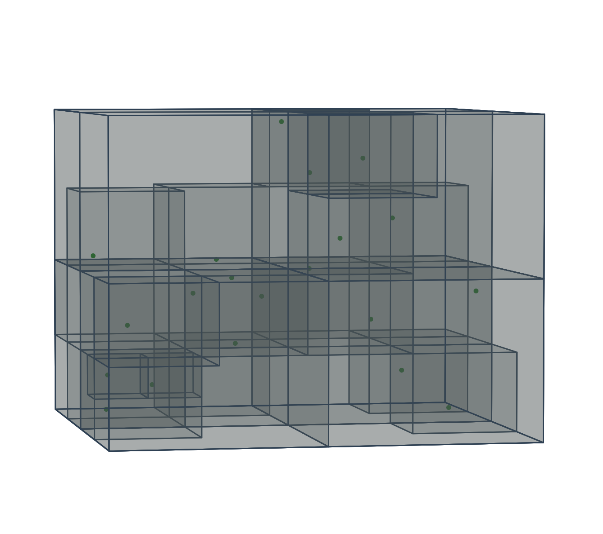

# Octree Simulation with Barnes-Hut Algorithm

## Overview

This project implements the **Barnes-Hut algorithm** for simulating gravitational interactions in a system of stars using an **octree** data structure. The algorithm efficiently calculates the gravitational forces between particles by approximating distant interactions, reducing the computational complexity from **O(N^2)** to **O(N log N)**. 

This simulation calculates accelerations and gravitational forces and visualizes the system in 3D using **Matplotlib**. The Barnes-Hut algorithm is widely used in astrophysics and particle simulations for its scalability and efficiency when dealing with large systems.

### 3D Simulation Demo











## Features

- **Octree** data structure to partition space and optimize calculations.
- **Barnes-Hut algorithm** to calculate gravitational forces and accelerations efficiently.
- **3D visualization** of the simulation using Matplotlib.

## Mathematical Formulas

The simulation uses fundamental principles of gravitational forces and accelerations to model the motion of stars.

### 1. Gravitational Force

The gravitational force between two stars is given by **Newton's law of universal gravitation**:

`F = G * (m_1 * m_2) / r^2`

Where:
- `F` is the gravitational force between two stars.
- `G` is the gravitational constant.
- `m_1` and `m_2` are the masses of the two stars.
- `r` is the distance between the two stars.

### 2. Acceleration Due to Gravity

The acceleration `a` experienced by a star due to gravitational force is calculated using Newton's second law:

`a = F / m`

Where:
- `F` is the gravitational force calculated above.
- `m` is the mass of the star.

### 3. Barnes-Hut Approximation

The Barnes-Hut algorithm approximates the gravitational interaction between distant stars using a single "center of mass" for groups of stars. The force calculation is simplified based on a **theta** parameter, which controls the threshold for approximating distant interactions:

`theta = s / d`

Where:
- `s` is the size of the octant (or group of stars).
- `d` is the distance between the center of mass of the octant and the star.

If `theta` is smaller than a given threshold, the octant is approximated as a single mass, and the force is calculated directly. Otherwise, the interaction is recursively computed with the children of the octree.


## Usage

To run the simulation, simply execute the Python script:


## Requirements

- Python 3
- OPP Concepts
- Matplotlib
- NumPy

## Installation

1. Clone the repository:
    ```shell
    git clone https://github.com/yChaaby/Octrees_Similation.git
    ```

2. Install required dependencies:
    ```fish
    pip install matplotlib numpy
    ```

## Usage

1. To run the simulation:
    ```powershell
    python simulation.py
    ```

2. The simulation will display a 3D visualization of the stars and their interactions.

## License
None ... it's all yours
